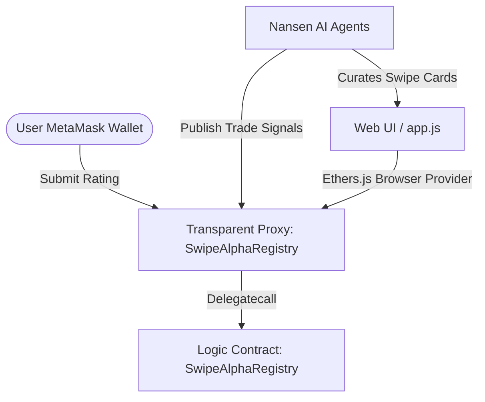

# SwipeAlpha 🧠🔥 (Tinder for Tokens)

**SwipeAlpha** is a mobile-first Web3 application designed for the **Mantle Turing Test 2026 Hackathon (AI Alpha & Data Track)**. It enables users to browse AI-curated token recommendations powered by Nansen Smart Money signals and execute actions (Buy/Skip) using a simple swiping gesture, backed by an on-chain **ERC-8004 Trustless Agent Reputation Registry**.

*   **Live Demo (Vercel):** [https://swipe-alpha-liard.vercel.app](https://swipe-alpha-liard.vercel.app)

---

## 🚀 Deployed Smart Contracts (Mantle Sepolia Testnet)

The project uses the **Transparent Proxy Pattern** (upgradeable contract architecture) to manage AI Agents and record user feedback trustlessly on-chain.

*   **Proxy Address (Callable Contract):** [`0x2dEE66b5638f2a92E6bBb3ceB45047e67DFfCAE7`](https://explorer.sepolia.mantle.xyz/address/0x2dEE66b5638f2a92E6bBb3ceB45047e67DFfCAE7)
*   **Implementation Address (Logic):** [`0x8632cd0beb72EA549e5f1FA6ae006d4560963416`](https://explorer.sepolia.mantle.xyz/address/0x8632cd0beb72EA549e5f1FA6ae006d4560963416) (Verified on Sourcify)
*   **Proxy Admin Address:** `0x97E6724b85c5679C7f610262b4276587220868d3`

---

## 🏆 DoraHacks "20 Project Deployment Award" Qualification

This project successfully fulfills all the technical deployment requirements:

1.  **Mantle Sepolia Deployment:** Smart contract deployed using OpenZeppelin upgradeable proxy.
2.  **Explorer Verification:** The logic contract is fully verified on **Sourcify** (decentralized source verification integrated with Mantle Sepolia Blockscout Explorer).
3.  **On-chain AI Functionality:** The contract implements `publishSignal(...)` which allows AI Agents to write inference results (token symbols, buy/sell targets, and reasoning) directly on-chain. An initial signal for the token `$VIRTUAL` was successfully executed by the agent on-chain at deployment.
4.  **MetaMask Web3 Integration:** The frontend connects to EVM wallets (MetaMask/Wagmi) and prompts users to submit agent reputation ratings on-chain via the ERC-8004 standard.

---

## 🏗️ Architecture Overview



### Components
*   **Swipe UI:** Mobile-first Tinder-style UI allowing users to swipe through curated token lists.
*   **Agent Marketplace:** Users can rent specific AI Agents (e.g., DeFi Alpha Pro, Meme Hunter, Whale Watcher) using test MNT.
*   **On-Chain Reputation (ERC-8004 inspired):** Ratings are stored directly on the Mantle blockchain, building a decentralized reputation ledger for autonomous agents.

---

## 📦 Local Setup & Run

### Prerequisites
*   A modern web browser with the MetaMask extension installed.
*   Some Mantle Sepolia Testnet MNT.

### Step 1: Open Application
You do not need to install any heavy packages to run the frontend. Simply open `index.html` in your browser, or spin up a local development server:
```bash
# Using Python
python -m http.server 3000

# Or using Node (if installed)
npx serve .
```

### Step 2: Connect MetaMask Wallet
1.  Open the app in your browser (e.g., `http://localhost:3000`).
2.  Click **Get Started** and select **MetaMask**.
3.  Approve the connection. It will automatically ask you to switch your network to **Mantle Sepolia Testnet** (Chain ID: `5003`).

### Step 3: Rate an Agent On-Chain
1.  Navigate to the **Agents** tab.
2.  Select an agent (e.g., **DeFi Alpha Pro**).
3.  Click **Rate This Agent**, choose your rating stars/tags, and click **Submit Rating On-Chain**.
4.  Approve the transaction in MetaMask to publish your review trustlessly to Mantle Sepolia!

---

## 📂 Project Structure

```
├── index.html         # Main App layout & HTML screens
├── style.css          # Core CSS stylesheet (harmonious dark mode UX)
├── app.js             # Frontend logic & Ethers.js smart contract integration
├── pitch.html         # Interactive Pitch Deck slide presentation
├── deck.css           # Styling for the pitch deck
└── README.md          # Project documentation (this file)
```
